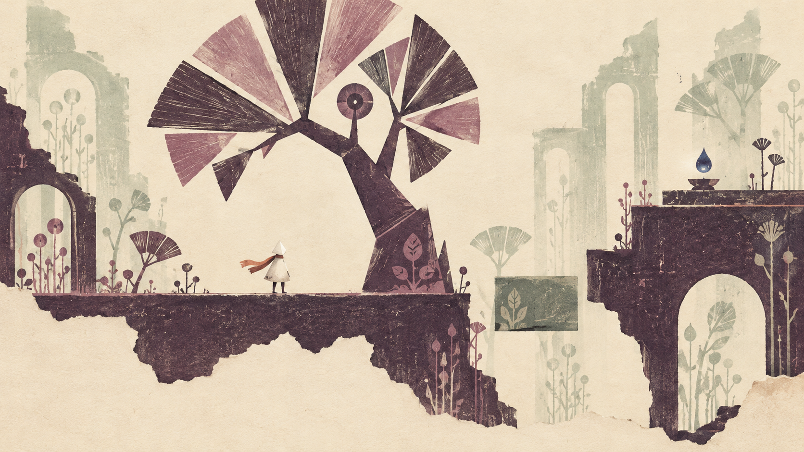

# PICTOUR 绘本世界美术定调提案

采用几何剪纸轮廓与手绘版画肌理，表现一部失去部分图层的童话绘本。怪诞感来自比例和空间关系，温柔感来自暖纸底、克制的色彩与安静的留白。用户已认可概念图与方向，首版已接入现有白模，见 [美术白模实现](美术白模实现_2026-10-08.md)。概念图用于讨论色彩、形状与材质，其完整图像未作为关卡底图。

## 叙事与视觉主旨

用户确定的叙事基础：完整世界原有前景、中景、背景、远景，主角拥有挪动物体、图层、影子和自己的能力。开场意外后只剩中景与背景，主角只能搬动物体；游玩中收集墨水，寻回图层和能力，逐步接近意外的真相。章节结束回到巨大空画卷所在的房间。

中景对应当前代码中的玩家层，不因美术命名改变槽位与碰撞。纸张是绘画媒介，不是额外的可操作图层。序章的空白应像内容被擦去后的缺席，仍保留明确道路和方向；完整世界的预览则显示图层之间的遮挡、视差与关系。

墨水既是收集物，也可成为重新显现画面内容的视觉材料。每次图层复归增加一种空间表现：前景带回近处的纸片、遮挡和触感，远景带回更淡的远处轮廓与纵深。具体章节与能力获得顺序仍由玩法设计决定，不在本次定调中锁定。

## 形状 色彩与材质

工作意象为“失页花园”，不是最终游戏名称。用圆扇、斜切梯形、细长枝干与折页台阶构成世界；树与建筑共享部分形状，产生树冠像门、台阶像折纸、桥像被撕开的书页等温和的错觉。每幅场景保留一个醒目的怪异形体，其他部分保持疏朗。

| 用途 | 初始色板 | 视觉规则 |
|---|---|---|
| 纸面与留白 | 暖米色 `#F2E8D4` | 细微静态纤维，给人物和交互留空间 |
| 中景实体 | 梅紫墨 `#3D344A` | 饱满块面，承重上沿清楚连续 |
| 少量次色 | 灰粉 `#B58B96` | 丰富树冠与刻线，避免覆盖重要轮廓 |
| 背景 | 灰鼠尾草 `#A8B8A4` | 较轻的着墨和边缘，待搬物的形状仍清楚 |
| 可搬物标记与人物识别点 | 朱砂 `#D76A49` | 统一纸签或印记，控制用量 |
| 墨水收集物 | 靛蓝 `#4D5B8C` | 明确墨滴轮廓和克制的局部光感 |

几何决定外形，干笔和刻线丰富块面。纸纹与套色偏移主要留在物体内部，站立边缘、角色剪影与选中轮廓保持清晰。正式游戏应比概念图降低颗粒与破边强度，特别检查缩小到实际游玩尺寸后的稳定性。角色可先探索小尺寸、无五官的纸片旅人，暖白轮廓配一小段朱砂色；其正式造型与身份尚未确定。

参考图提供的是层次、留白与唯美平台场景的理解。差异化落在暖纸色、剪纸与刻印痕迹、绘本物件的超现实比例，以及图层复归改变整幅画面构成的过程。

## 玩法辨识规则

| 玩家需要判断的事 | 画面回答 |
|---|---|
| 这里能否站立 | 中景实体有清楚、连续的顶边，位置与真实碰撞一致 |
| 物件能否搬运 | 同一种朱砂纸签或印记；装饰不使用此标记 |
| 背景箱能否交互 | 箱体着墨较淡，但轮廓与纸签足够清楚，便于对齐与选择 |
| 背景装饰能否交互 | 无纸签、少刻线，不画容易误判成落脚处的强顶边 |
| 搬运是否成功 | 同一形体保留当前屏幕位置并重新着墨，切换成所在层的实体表现 |

深度、可搬运和选中状态使用不同线索，不全依赖颜色。背景物件不宜全面模糊，玩家需要看清边界来对齐。日后前景遮挡要照顾角色与交互目标，不让装饰阻断关键玩法信息。

## 程序与生成素材分工

程序美术先负责尺寸可控的平台、台阶、树干骨架、画具匣、纸签、门与画卷，以及各层的着墨和选中反馈。视觉内容继续放在 VisualRoot，保留实体位置、碰撞与投影规则。

生成素材用于概念、纸纹、干笔块面、装饰植物与画室氛围；正式场景由独立资产搭建，让可搬运物和可探索路径各自可编辑。按需生成透明独立素材，而不是把完整概念图作为所有玩法空间的底图。

现有 TransferPlatform 的碰撞和点选都是矩形，首批美术围绕矩形承重主体设计。当前挡路树是细长长方体，第一版可做成致密纸树柱；概念图里大幅展开的树冠不能直接套上原碰撞。大幅改变外轮廓时，需要同步调整碰撞和点选区域，避免透明处挡路或空白处被选中。会产生视差的装饰也需要接入当前投影管理。

## 首个美术实验

选择现有 F2 移树、搬箱、登台开门，制作约 30–60 秒的美术片段：梅紫纸树柱、带朱砂纸签的背景画具匣、折页高台与细长门，加入少量背景刻印植物。先验证一个物件的背景、中景和选中三种状态，再扩展资产。

试玩时隐藏教学文字，检查是否能找到可搬物、分清背景与可站立实体、搬入后立即理解它成为实体，以及移动时颗粒和轮廓是否稳定。通过后再扩展墨水、画室、四景预览和正式序章节奏。

## 概念图与来源

- 概念图：`Art/Concepts/Paper_Garden_01.png`。
- 完整提示词：`Art/Concepts/Paper_Garden_01.prompt.txt`。
- 来源记录：`Art/Concepts/Paper_Garden_01.source.json`。
- 生成工具：内置 imagegen；工具返回信息未提供具体模型版本。本图为新生成的概念预览，未做图像编辑，未接入运行场景。
- 用户提供 GRIS 截图作为美术讨论参考；生成时未作为图像输入，提示词要求原创构图与视觉身份。角色、树冠和建筑仍需在生产阶段针对可读性与实际碰撞重新设计。
